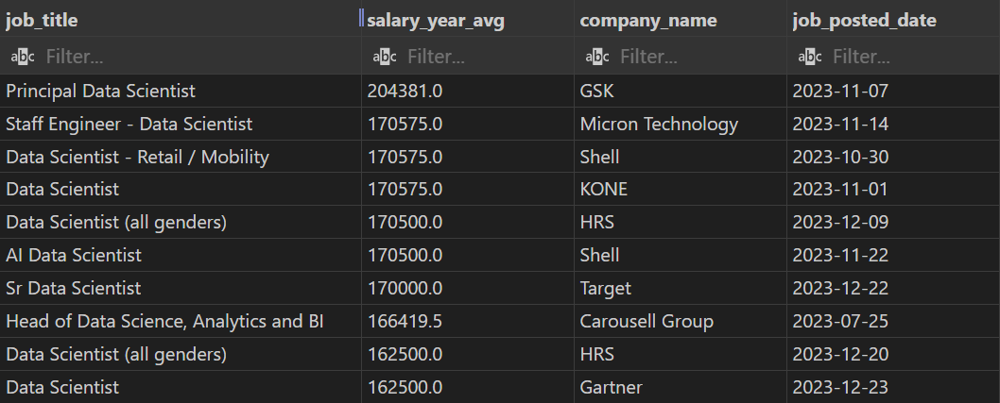
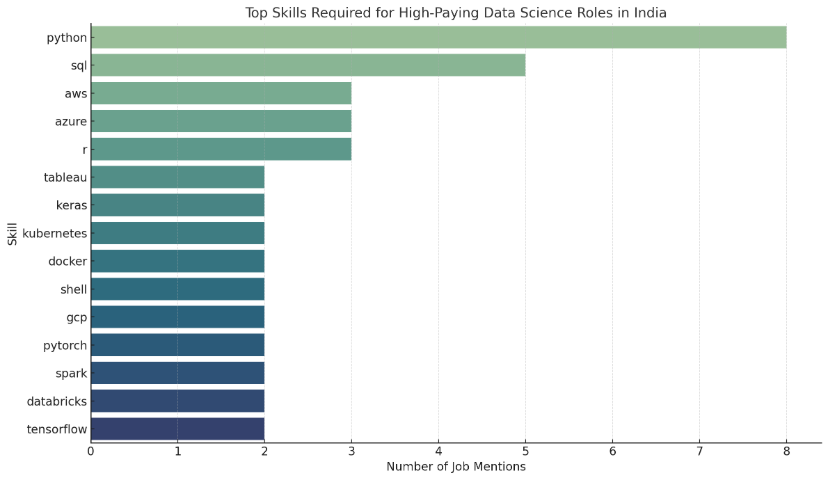
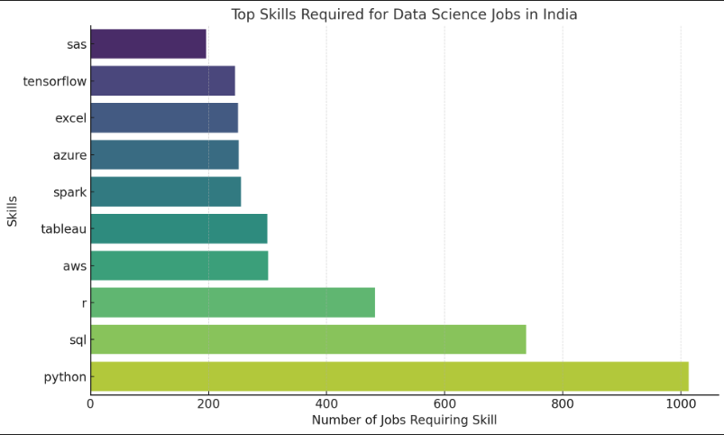
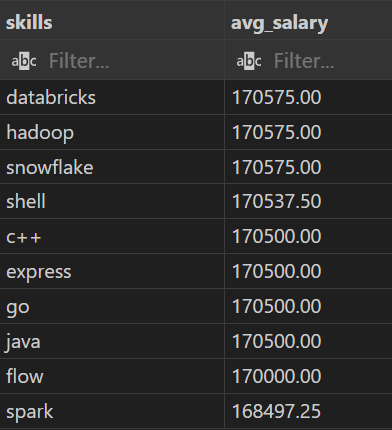
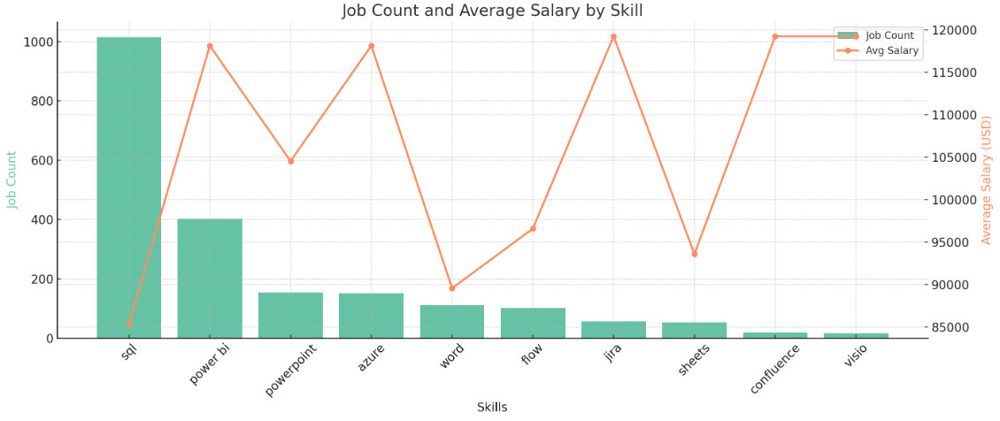

# 📊 SQL Data Science Job Analysis (India)

This project explores trends in data science jobs across India using SQL-based data analysis. It uncovers key insights about salaries, in-demand skills, and top companies hiring for data science roles.

---

## 📌 Introduction

With the rising demand for data-driven decision-making, the field of data science has become one of the most lucrative and sought-after career paths. This project analyzes job listings and skill requirements for data science roles in India using structured SQL queries and databases.

---

## 📂 Background

The goal of this analysis is to identify:
- Top-paying companies and roles in data science
- Most demanded technical skills
- Correlation between skill demand and salary
- Tools and platforms that are shaping the data science ecosystem

The analysis is conducted using datasets containing job listings, skill requirements, and compensation data from various companies operating in India.

---

## 🛠 Tools Used

- **SQL (PostgreSQL & SQLite)** – for querying and data manipulation  
- **VS Code** – used as the primary code editor  
- **DB Browser for SQLite** – for database management  
- **pgAdmin / DBeaver** – for PostgreSQL interface and execution  
- **Excel** – for basic analysis and data cleanup

---

## 📊 The Analysis

### 🔹 1. Top Paying Jobs for Data Science in India

- **GSK** offers the highest average salary (~$204k) for the *Principal Data Scientist* role.
- **Shell, HRS, and KONE** offer consistent salaries (~$170k) for standard data scientist positions.
- **Carousell Group** offers a slightly lower salary (~$166k) for lead/head roles.
- **Gartner** offers the lowest average salary (~$162.5k) among the top.
  

---

### 🔹 2. Top Highest-Paying Skills in Data Science (India)

- **Python & SQL** are core across nearly all roles.
- **Cloud platforms** like *AWS* and *Azure* are critical for scalable deployments.
- **ML Libraries**: *Scikit-learn*, *TensorFlow*, *PyTorch* are essential for modeling.
- **Visualization Tools** like *Tableau* and *Power BI* are vital for analyst roles.
- **Big Data & DevOps Tools** (*Spark*, *Docker*, *Kubernetes*) appear in senior positions.

---

### 🔹 3. Top Skills Based on Job Count

- **Python & SQL** dominate job descriptions across experience levels.
- **AWS, Azure, Spark** show high frequency for senior or scalable applications.
- **Visualization Tools** like *Tableau*, *Excel* remain relevant for stakeholder presentations.
- **Deep Learning** tools (*TensorFlow*) are gaining traction.
- **R & SAS** retain niche value in specific domains like healthcare and finance.

---

### 🔹 4. Top Skills Based on Average Salary

- **Databricks, Hadoop, Snowflake** top salary charts (~₹170,575).
- **Shell Scripting** follows closely (~₹170,537.50).
- Languages like **C++, Java, Go, Express** offer salaries around ₹170,500.
- **Spark** remains competitive at ₹168,497.25.
- Even **Flow** shows surprisingly good pay (~₹170,000).

---

### 🔹 5. Skills Based on Both Demand & Salary

- **Most In-Demand**: *SQL* with over 1,000 postings, despite a lower avg salary (~$85K).
- **Top Paying but Rare**: *Jira*, *Confluence*, *Visio* with avg ~$119K, but under 60 postings each.
- **Best Balance**: *Power BI* — high demand (402 jobs) and high salary (~$118K).
- **Low Demand & Low Salary**: *Word*, *Sheets*, and *Flow* lag behind in both metrics.

---

## 🧠 What I Learned

- Gained hands-on experience in writing advanced SQL queries involving joins, aggregations, and nested logic.
- Understood how to derive actionable business insights from raw job data.
- Improved my ability to clean, analyze, and interpret real-world datasets using SQL.
- Learned how to connect skills demand to job market trends and technology adoption.

---

## ✅ Conclusion

This SQL project helped me understand the intersection between data science skill sets and the Indian job market. It showcased how SQL can be a powerful tool for extracting valuable insights from structured data and understanding employer expectations in the tech industry.

---

## 👤 Author

**Mohammed Aqlath A**  
LinkedIn:
www.linkedin.com/in/mohammed-aqlath-a-26baa3248
